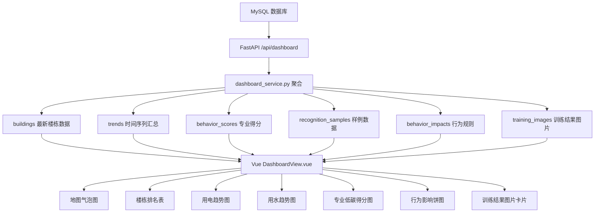

# 可视化数据说明与图片清单

## 1. 文档目的

本文档用于说明当前项目中所有“数据可视化展示”的来源、排序逻辑、前端加工方式，以及页面实际展示的图片资产。

项目当前主页面位于：

- `apps/web/src/features/dashboard/DashboardView.vue`

后端聚合入口位于：

- `apps/api/app/services/dashboard_service.py`
- `apps/api/app/api/routes.py`

核心数据表模型位于：

- `apps/api/app/models/campus.py`

---

## 2. 总体数据流



---

## 3. 每个可视化模块的数据库来源

### 3.1 顶部四个指标卡

页面位置：

- `DashboardView.vue` 顶部 `metrics-grid`

#### 1. 识别行为样例

数据库来源：

- 表：`recognition_samples`
- 前端字段：`recognitionSamples.length`

生成方式：

- 后端 `get_dashboard()` 查询 `RecognitionSample`，按 `id` 升序返回。
- 前端接收后转换为 `recognitionSamples` 数组。
- 指标卡直接显示数组长度。

排序逻辑：

- 数据本身按 `recognition_samples.id` 升序。
- 卡片展示的是总条数，不再二次排序。

#### 2. 覆盖楼栋

数据库来源：

- 表：`buildings`
- 表：`energy_predictions`

生成方式：

- 后端先在 `energy_predictions` 中取最大 `time_step`。
- 再关联 `buildings`，只拿该最新时间步对应的全部楼栋记录。
- 前端显示 `buildingRecords.length`。

排序逻辑：

- 后端按 `buildings.name` 升序返回。
- 卡片展示的是总条数，不再二次排序。

#### 3. 用电趋势指数

当前状态：

- `value="高活跃"` 是前端写死文案，不是数据库计算结果。

#### 4. 用水趋势指数

当前状态：

- `value="中高位"` 是前端写死文案，不是数据库计算结果。

---

### 3.2 左侧“高用电楼栋”排行

页面位置：

- `DashboardView.vue` 左下角 `ranking-block`

数据库来源：

- 表：`buildings`
- 表：`energy_predictions`

使用字段：

- `building.name`
- `energy_predictions.electricity_actual`

生成方式：

- 后端取“最新 `time_step` 的每栋楼数据”。
- 前端把返回结果保存到 `buildingRecords`。
- `topBuildings` 由前端计算：
  - 按 `electricityActual` 降序排序
  - 取前 5 条

排序逻辑：

1. `electricityActual` 从大到小
2. 只截取前 5 条

进度条逻辑：

- 每栋楼的条形长度 = `当前楼栋 electricityActual / 排名第 1 楼栋 electricityActual * 100`

---

### 3.3 中部校园楼栋气泡图

页面位置：

- `apps/web/src/features/dashboard/components/BuildingMap.vue`

数据库来源：

- 表：`buildings`
- 表：`energy_predictions`

使用字段：

- `buildings.name`
- `buildings.zone`
- `buildings.major`
- `buildings.map_x`
- `buildings.map_y`
- `energy_predictions.electricity_actual`
- `energy_predictions.water_actual`
- `energy_predictions.electricity_error`
- `energy_predictions.water_error`

生成方式：

- 后端返回最新 `time_step` 下每栋楼的最新水电数据与地图坐标。
- 前端逐条渲染成气泡按钮。

排序逻辑：

- 气泡图本身不按列表排序。
- 每个气泡的位置由 `map_x/map_y` 决定，不按数值重新排位。

可视化规则：

- 气泡大小：
  - `size = 30 + sqrt(当前楼栋用电 / 全部楼栋最大用电) * 46`
- 气泡颜色分级：
  - `electricityActual / maxElectricity >= 0.72`：高强度
  - `>= 0.32`：中强度
  - `< 0.32`：低强度
- Tooltip 中“预测状态”：
  - 先算 `(electricityError + waterError) / (electricityActual + waterActual) * 100`
  - 再乘 `0.45` 做展示压缩
  - `>=45`：重点关注
  - `>=20`：轻度波动
  - `<20`：趋势稳定

注意：

- 地图底图不是一张图片，而是 CSS 网格背景 + 三条装饰路线。
- 因此它属于“程序绘制可视化”，不是图片资源。

---

### 3.4 右侧楼栋表格“可视化预测概览”

页面位置：

- `DashboardView.vue` 右侧 `ElTable`

数据库来源：

- 表：`buildings`
- 表：`energy_predictions`

使用字段：

- `name`
- `zone`
- `major`
- `electricity_actual`
- `water_actual`
- `electricity_error`
- `water_error`

生成方式：

- 后端仍然返回最新 `time_step` 的楼栋数据。
- 前端二次加工生成 `tableData`。

前端加工逻辑：

1. 求全体楼栋中的最大 `electricityActual`
2. 求全体楼栋中的最大 `waterActual`
3. 计算：
   - `electricityPercent = electricityActual / maxElectricity * 100`
   - `waterPercent = waterActual / maxWater * 100`
4. 计算展示偏差：
   - `deviationRaw = (electricityError + waterError) / (electricityActual + waterActual) * 100`
   - `deviationDisplay = deviationRaw * 0.45`

排序逻辑：

前端按以下顺序排序：

1. `electricityPercent` 降序
2. 若相同，则按 `waterPercent` 降序
3. 若仍相同，则按 `combinedRankScore` 降序

其中：

- `combinedRankScore = electricityPercent * 0.55 + waterPercent * 0.45`

展示说明：

- “排名”是前端表格排序后的行号，不是数据库原始排名字段。

---

### 3.5 用电趋势图

页面位置：

- `DashboardView.vue` 底部左侧 `electricityChartOption`

数据库来源：

- 表：`energy_predictions`

使用字段：

- `time_step`
- `electricity_actual`
- `electricity_predicted`

生成方式：

- 后端 `get_trends()` 按 `time_step` 分组。
- 对每个时间步：
  - `sum(electricity_actual)`
  - `sum(electricity_predicted)`
- 再按 `time_step` 升序返回。

排序逻辑：

1. SQL 层按 `time_step` 升序
2. 前端按该顺序直接渲染

前端加工逻辑：

- 前端不是直接画原始值，而是先调用 `normalizeSeries()`：
  - 取当前序列最大值 `maxValue`
  - 每个点转换为 `value / maxValue * 100`
- 所以前端展示的是“归一化对比趋势”，不是数据库原始数值刻度。

---

### 3.6 用水趋势图

页面位置：

- `DashboardView.vue` 底部中间 `waterChartOption`

数据库来源：

- 表：`energy_predictions`

使用字段：

- `time_step`
- `water_actual`
- `water_predicted`

生成方式：

- 后端 `get_trends()` 按 `time_step` 聚合：
  - `sum(water_actual)`
  - `sum(water_predicted)`

排序逻辑：

1. SQL 层按 `time_step` 升序
2. 前端按该顺序渲染

前端加工逻辑：

- 同样先做 `normalizeSeries()` 归一化到 0~100。
- 图中：
  - 实际用水：柱状图
  - 预测用水：折线图

---

### 3.7 专业低碳行为得分图

页面位置：

- `DashboardView.vue` 底部右侧 `behaviorChartOption`

数据库来源：

- 表：`behavior_scores`

使用字段：

- `major_name`
- `total_score`

生成方式：

- 后端查询 `BehaviorScore`
- 按 `major_code` 升序返回
- 前端映射为：
  - 横轴：`major`
  - 纵轴：`score`

排序逻辑：

1. SQL 层按 `behavior_scores.major_code` 升序
2. 前端不再额外排序

因此图表顺序就是：

- 理工科
- 文科
- 商科/管理
- 艺术/设计
- 医学/生物
- 其他

---

### 3.8 行为影响饼图

页面位置：

- `DashboardView.vue` 中部右侧 `behaviorImpactPieOption`

数据库来源：

- 表：`behavior_impacts`

使用字段：

- `behavior_name`
- `electricity_factor`
- `water_factor`

生成方式：

- 后端查询 `BehaviorImpact`
- 按 `id` 升序返回
- 前端为每个行为构造饼图项：
  - 名称 = `behavior_name`
  - 值 = `max(1, round((abs(electricity_factor) + abs(water_factor)) * 100))`

排序逻辑：

1. SQL 层按 `behavior_impacts.id` 升序
2. 前端保持该顺序

说明：

- 饼图占比不是数据库现成字段。
- 它是前端根据“用电影响因子 + 用水影响因子”的绝对值求和后，重新计算出来的展示权重。

---

### 3.9 上传识别结果卡片

页面位置：

- `DashboardView.vue` 中部“行为 1 / 行为 2 / 行为影响”

数据库来源：

- 表：`uploaded_images`
- 表：`recognition_tasks`
- 表：`recognition_results`

接口来源：

- `POST /api/uploads/images`
- `GET /api/uploads/tasks/{task_id}`

生成方式：

1. 用户上传图片
2. 后端保存文件并写入 `uploaded_images`
3. 创建 `recognition_tasks`
4. 如果模型配置完整，则后台调用视觉模型
5. 模型返回的每条识别结果写入 `recognition_results`
6. 前端轮询任务接口并渲染结果

排序逻辑：

- 后端在 `_load_task_bundle()` 中按 `RecognitionResult.id` 升序返回
- 前端按返回顺序逐卡片展示

展示内容：

- 行为名称：`behavior_name`
- 位置：`location_name`
- 置信度：`confidence`
- 影响说明：`impact_summary`
- 用电影响：`electricity_delta_kwh`
- 用水影响：`water_delta_m3`

---

### 3.10 上传状态与进度条

页面位置：

- 左侧上传框

数据库来源：

- 表：`recognition_tasks`

使用字段：

- `status`
- `error_message`
- `finished_at`

生成方式：

- 后端根据任务状态返回固定进度：
  - `queued` -> 28
  - `running` -> 76
  - `succeeded` -> 100
  - `failed` -> 100
  - `pending_model_config` -> 100

说明：

- 这不是数据库里存的“真实百分比”，而是后端根据任务状态映射出的展示进度。

---

## 4. 页面上展示的图片清单

### 4.1 当前真实显示的图片

#### 1. 用户上传预览图

页面位置：

- 中部识别结果区左侧预览图

来源：

- 表：`uploaded_images.public_url`

生成方式：

- 文件先保存到后端上传目录
- `storage_service.py` 生成 `public_url`
- 前端通过 `uploadedImage.image.public_url` 显示

#### 2. 训练结果图 1：用电预测训练结果

页面位置：

- “关联展示图建议”卡片第 1 张

来源：

- 表：`training_images`
- 字段：`image_url`
- 静态文件：`apps/web/public/training/electricity_prediction.png`

显示顺序：

- 按 `training_images.id` 升序取前 4 张
- 当前是第 1 条

#### 3. 训练结果图 2：训练损失曲线

来源：

- 表：`training_images`
- 静态文件：`apps/web/public/training/training_loss.png`

显示顺序：

- 第 2 条

#### 4. 训练结果图 3：用水预测训练结果

来源：

- 表：`training_images`
- 静态文件：`apps/web/public/training/water_prediction.png`

显示顺序：

- 第 3 条

#### 5. 训练结果图 4：低碳行为得分

来源：

- 表：`training_images`
- 静态文件：`apps/web/public/training/behavior_score.png`

显示顺序：

- 第 4 条

---

### 4.2 数据库中存在、但当前页面不直接展示的图片字段

#### 1. `recognition_samples.image_url`

说明：

- 该字段在示例识别数据表中存在。
- 当前 `DashboardView.vue` 没有把这张图直接渲染到页面上。
- 它更像“样例数据预留字段”。

#### 2. 浏览器标签图标 `favicon.svg`

说明：

- 文件位于 `apps/web/public/favicon.svg`
- 用于浏览器 tab，不属于页面主体展示图片。

---

## 5. 页面图片生成与展示流程图

```mermaid
flowchart TD
    A1[本地训练结果图片] --> A2[init_db.py 复制到 apps/web/public/training]
    A2 --> A3[training_images 表写入 image_url]
    A3 --> A4[/api/dashboard 返回 training_images]
    A4 --> A5[前端按 id 升序取前4张]
    A5 --> A6[训练结果图片卡片展示]

    B1[用户上传图片] --> B2[save_upload_file 保存文件]
    B2 --> B3[uploaded_images 写入 public_url]
    B3 --> B4[recognition_tasks 创建任务]
    B4 --> B5[视觉模型分析]
    B5 --> B6[recognition_results 写入行为结果]
    B6 --> B7[/api/uploads/tasks/{id}]
    B7 --> B8[前端显示上传预览图和识别结果卡片]
```

---

## 6. 初始化数据从哪里来

数据库演示数据主要由 `apps/api/scripts/init_db.py` 导入，来源分三类：

### 6.1 楼栋与预测数据

来源文件：

- `prediction_results.csv`

导入表：

- `buildings`
- `energy_predictions`

逻辑：

- 先抽取唯一建筑名称创建楼栋
- 再把每个时间步的预测结果写入 `energy_predictions`

### 6.2 专业低碳得分

来源文件：

- `behavior_summary(1).csv`

导入表：

- `behavior_scores`

逻辑：

- 每个专业类别写一条
- `Q3 ~ Q10` 各列写入单项得分
- `综合行为得分` 写入 `total_score`

### 6.3 行为规则、识别样例、训练图片

来源：

- `init_db.py` 中的固定种子数据

导入表：

- `behavior_impacts`
- `recognition_samples`
- `training_images`

说明：

- 这部分当前是演示型/规则型数据，不是实时模型回写。

---

## 7. 适合答辩时的结论

可以直接这样概括：

1. 所有主可视化都统一由 `/api/dashboard` 提供数据，前端只做轻量展示加工。
2. 水电预测类可视化来自 `energy_predictions`，并通过“最新时间步”和“按时间步汇总”两种方式生成。
3. 行为问卷类可视化来自 `behavior_scores`，按专业编码顺序展示。
4. 行为影响饼图来自 `behavior_impacts`，占比是前端根据水电影响因子重新计算的。
5. 训练结果图片和上传图片分别来自 `training_images` 与 `uploaded_images` / `recognition_results`。

